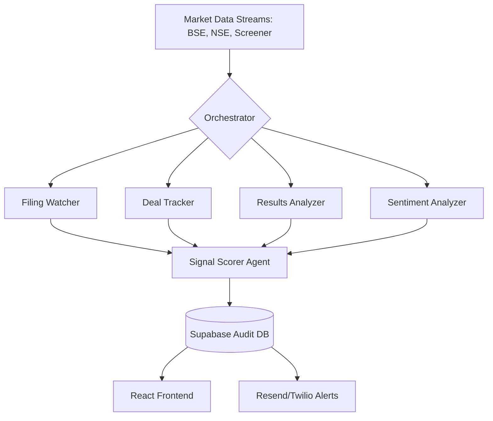

# 📡 Opportunity Radar: Autonomous Market Intelligence Swarm

> **Empowering Investors with Multi-Agent Intelligence.**  
> *Developed for the ET Gen AI Hackathon 2026*

Opportunity Radar is a production-grade market intelligence portal that autonomously monitors BSE/NSE corporate disclosures, institutional bulk deals, and market sentiment. By leveraging a **self-orchestrating swarm of 5 AI agents (powered by CrewAI, Sarvam AI, and Gemini)**, the platform filters through thousands of routine filings to extract high-conviction "Material Alpha" in real-time.

---

## 🚀 Core Platform Features

### 1. The Intelligence Portal (Frontend)
A premium, responsive React dashboard featuring four primary views:
- **Dashboard**: Real-time NIFTY/SENSEX market stats and the Top 5 most recent high-conviction signals.
- **Live Signals (Radar)**: A comprehensive feed of all agent-generated alerts with dynamic filtering by sector, category, and intelligent search.
- **Watchlist**: Track specific stocks with AI sentiment dynamically mapped from the latest intelligence signals (`Bullish`, `Bearish`, `Neutral`).
- **Backtest Lab**: Validate signal precision. Replay our proprietary SMA 20/50 "Golden Cross" detection algorithm against historical price action to simulate win rates and equity curves.

### 2. Multi-Channel Alert System
High-conviction alerts are autonomously routed directly to investors:
- **Email (Resend)**: Triggered for signals with a Conviction Score ≥ 7.0.
- **WhatsApp (Twilio)**: Immediate priority delivery for extreme conviction signals (Score ≥ 9.0).
- *Both channels format alerts identically to the specified PRD templates.*

### 3. Absolute Auditability (Database)
The system is designed for 100% traceability via Supabase PostgreSQL:
- **`raw_events`**: The original, unmodified JSON scraped from the exchanges.
- **`agent_outputs`**: The raw "thoughts", reasoning, and sentiment of individual agents.
- **`signals`**: The final, synthesized intelligence result shown to the user.

---

## 🧠 Hybrid Swarm Architecture

We utilize a **Hierarchical Multi-Agent System** that splits cognitive load for maximum efficiency and minimum latency.



### The 5 Agents
1. **BSE Filing Analyst** *(Powered by Gemini 1.5 Flash)*: Chews through high-volume corporate announcements to distinguish "Routine Administrative" from "Material Impactful" disclosures.
2. **Institutional Deal Tracker** *(Powered by Gemini 1.5 Flash)*: Monitors NSE 'Bulk & Block' deals to identify "Smart Money" accumulation and distribution patterns.
3. **Results Analyzer**: Parses quarterly earnings (Screener.in) to identify PAT beats and margin expansions.
4. **Management Sentiment Analyzer**: Extracts forward-looking confidence metrics from earnings concall transcripts.
5. **Signal Conviction Scorer** *(Powered by Sarvam-M 24B)*: The final intelligence layer. Synthesizes the diverging viewpoints of all other agents into a single, definitive conviction score (0-10) and determines the final `action_suggestion`.

---

## 🛠 Technical Stack

- **Intelligence**: Sarvam-M 24B (Reasoning) & Gemini 2.5 Flash (Parsing) orchestrated by `CrewAI`.
- **Backend / Pipeline**: FastAPI + Uvicorn Python backend running an APScheduler high-frequency polling loop.
- **Data Integrations**: `yfinance` (Live Price/Indices), Custom BSE/NSE parsers, `screener_client.py`.
- **Database**: Supabase (PostgreSQL) leveraging JSONB columns for raw exchange data storage.
- **Frontend**: React + Vite + CSS Variables (Glassmorphism UI) + Recharts + Framer Motion.
- **Notifications**: `httpx` direct API integration with Twilio (WhatsApp) and Resend (Email).

---

## 🏁 Quick Start & Setup

### 1. Install Dependencies
```bash
# Frontend
cd frontend
npm install

# Backend
cd backend
pip install -r requirements.txt
```

### 2. Environment Variables
Create a `.env` file in the `backend/` directory using `.env.example` as a template:
```env
# AI Models
SARVAM_API_KEY=your_sarvam_key
GEMINI_API_KEY=your_gemini_key

# Database
SUPABASE_URL=your_project_url
SUPABASE_KEY=your_service_role_key

# Notifications
RESEND_API_KEY=your_resend_api_key
TWILIO_SID=your_twilio_sid
TWILIO_TOKEN=your_twilio_token
TWILIO_WHATSAPP_FROM=whatsapp:+14155238886
ALERT_EMAIL=investor@example.com
ALERT_WHATSAPP=whatsapp:+919876543210
```

### 3. Launch the Platform
Start the backend orchestrator (port 8000) and frontend portal (port 5173) in separate terminals:
```bash
# Terminal 1: Backend Swarm
cd backend
python main.py

# Terminal 2: Intelligence Portal
cd frontend
npm run dev
```

---
*Created for the ET Gen AI Hackathon 2026. Code strictly adheres to provided PRD specifications.*