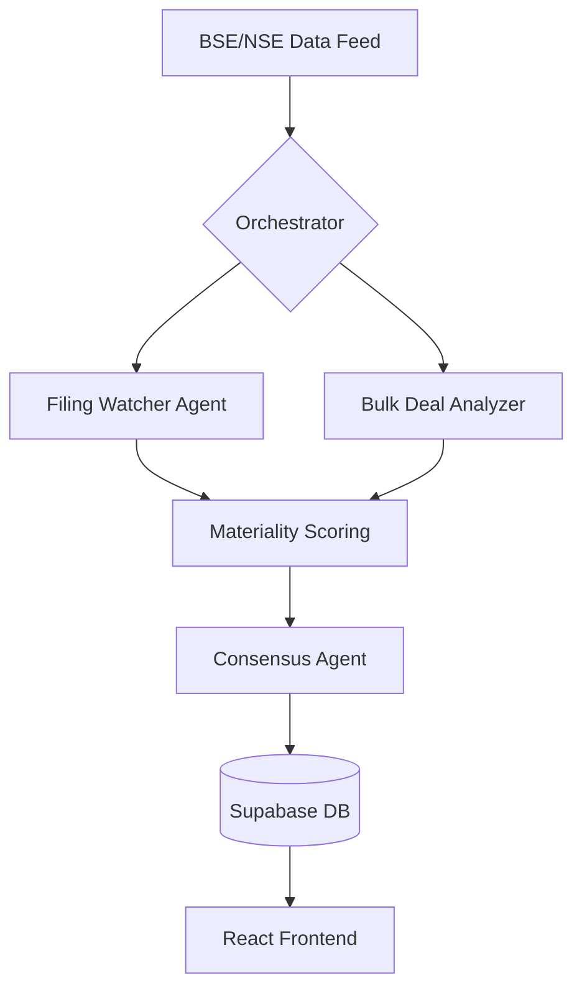

# 📡 Opportunity Radar: Autonomous Market Intelligence Swarm

> **Empowering Investors with Multi-Agent Intelligence.**  
> *Developed for the ET Gen AI Hackathon 2026*

Opportunity Radar is a production-grade intelligence portal that autonomously monitors BSE/NSE corporate disclosures, institutional bulk deals, and market sentiment. By leveraging a **self-orchestrating swarm of AI agents (CrewAI)**, the platform filters through thousand of routine filings to extract high-conviction "Material Alpha" in real-time.

---

## 🚀 Core Features

### 1. Live Intelligence Radar
A glassmorphism-inspired dashboard that displays real-time "Convergence Signals." Each signal is the result of multiple AI agents reaching consensus on a corporate event.
- **Dynamic Filtering**: Filter by Sector (Tech, Energy, Finance) or Category (Mergers, Earnings, Insider Activity).
- **Conviction Scoring**: Signals are scored 0–10 based on institutional impact, not just sentiment.

### 2. The Convergence Lab (Backtest)
Validate the radar's precision by replaying historical agent logic on past market data.
- **Simulation Engine**: Select any ticker and date range to see how the agents *would have* scored historical filings.
- **Equity Curve**: Visualize the theoretical performance of AI-driven signals against actual historical price action.

### 3. Agentic Audit Trail
Total transparency. Every signal in the database is linked to the specific raw filing and the specific agent thought-process that generated it.

---

## 🧠 Agent Architecture (The Swarm)

We utilize a **Hierarchical Multi-Agent System** powered by `CrewAI` and `Gemini 1.5 Flash`.

### The Agents:
1.  **BSE Filing Analyst**: Trained to distinguish between "Routine Administrative" and "Material Impactful" disclosures (e.g., distinguishing a boilerplate board meeting from a surprise acquisition).
2.  **Institutional Flow Agent**: Monitors 'Bulk & Block' deals to identify "Smart Money" accumulation patterns.
3.  **Signal Conviction Scorer**: The final intelligence layer. It synthesizes diverging viewpoints from other agents into a single, actionable conviction score.

---

## 🛠 Technical Stack

- **Intelligence**: Gemini 1.5 Flash (Multi-Agent Swarm via CrewAI)
- **Backend**: FastAPI + Uvicorn + APScheduler (High-frequency polling)
- **Data**: yfinance (Live Price/Indices) + BSE/NSE Unofficial APIs
- **Database**: Supabase (PostgreSQL) with JSONB for raw event storage
- **Frontend**: React + Vite + Tailwind + Recharts + Framer Motion

---

## 📊 Database Schema (Auditability)

The system is designed for 100% traceability. Every "Signal" you see in the UI points back to a Chain of Custody:

1.  **`raw_events`**: Stores the original, unmodified JSON from the exchange.
2.  **`agent_outputs`**: Stores the raw "thoughts" and sentiment of individual agents.
3.  **`signals`**: The final, user-facing intelligence result.

---

## 📽 Visual Showcase

### **Autonomous Intelligence Pipeline in Action**

*Automated detection of a material filing with categorized conviction.*

### **The Backtest Lab**

*Simulating historical agent logic against real RELIANCE price action.*

---

## 🏁 Quick Start

1. **Clone & Setup**: `npm install` (frontend) and `pip install -r requirements.txt` (backend).
2. **Env Connection**: Ensure `SUPABASE_URL` and `GEMINI_API_KEY` are set in `.env`.
3. **Launch Swarm**: `python main.py` in the backend folder.
4. **View Portal**: `npm run dev` in the frontend folder.

---
*Created for the ET Gen AI Hackathon 2026. Empowering investors with autonomous, agentic intelligence.*